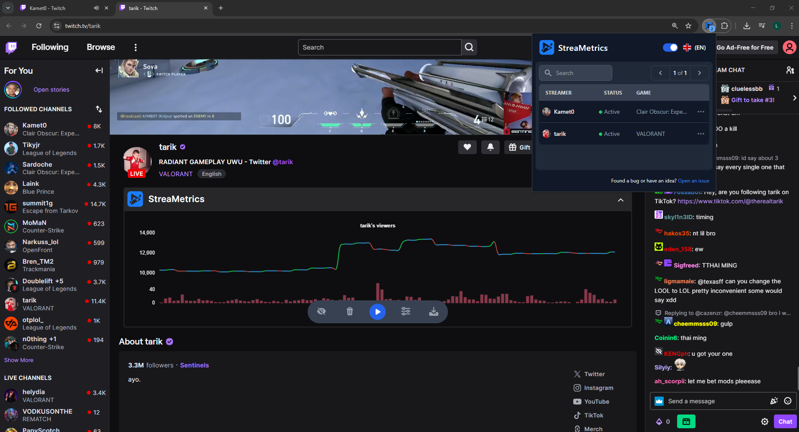

#  StreaMetrics

**StreaMetrics** is an open-source Chrome extension that adds a real-time analytics graph below Twitch streams, showing the evolution of **viewer count** and **chat activity** over time.



## ✨ Features

- 📈 Real-time line graph showing:
  - Number of **viewers**
  - Number of **messages sent** in the chat
- ⚡ Seamlessly integrates with Twitch stream pages
- 💡 Lightweight and intuitive UI
- 🔍 Helps streamers and viewers understand stream engagement dynamics at a glance
- 💾 Export / Import datasets in chart.
- 📥 Export chart as image.

## 🧩 How It Works

Once installed, StreaMetrics automatically detects when you're watching a Twitch stream and injects a live graph just below the video player. The graph updates in real-time, giving you insights into stream popularity and chat engagement.

## 📦 Installation

### From Chrome Web Store

> _Coming soon..._

### Manual Installation (Developer Mode)

1. Clone this repository:
   ```bash
   git clone https://github.com/LilianSeon/streametrics.git
   cd streametrics
   npm i && npm run build

2. Open Chrome and go to chrome://extensions/

3. Enable Developer mode (top right)

4. Click on Load unpacked

5. Select the extension folder `/dist`

That’s it! Open a Twitch stream and watch the graph appear below the player.

## ▶️ Usage
### Open a Twitch Stream
- Go to any live stream on [twitch.tv](https://www.twitch.tv)

### View the Graph
- The StreaMetrics graph will automatically appear below the video player

- Hover over the graph to see detailed information about:

  - Viewer count

  - Number of chat messages over time

### Customize Settings
- You'll find a menu at the bottom of the chart

- Adjust:

    - Graph appearance (Display line or bars)

    - Clear data

    - Refresh rate

## 🛠️ Development
This extension is built with:

 - JavaScript / TypeScript

 - HTML + TailwindCSS

 - React for popup

 - Chart.js for data visualization

 - Chrome Extension APIs

To get started:

```console
npm install
npm run build
```

## 🤝 Contributing
We welcome contributions from the community!

1. Fork the repository

2. Create a new branch (git checkout -b feature/your-feature)

3. Commit your changes (git commit -m 'Add new feature')

4. Push to your fork (git push origin feature/your-feature)

5. Open a Pull Request

Feel free to open [issues](https://github.com/LilianSeon/extension/issues) for bug reports or feature suggestions.

## 📄 License
This project is licensed under the MIT License.

## 📫 Contact
Questions or suggestions?
Reach out via GitHub issues or email us at seonlilian@gmail.com.
